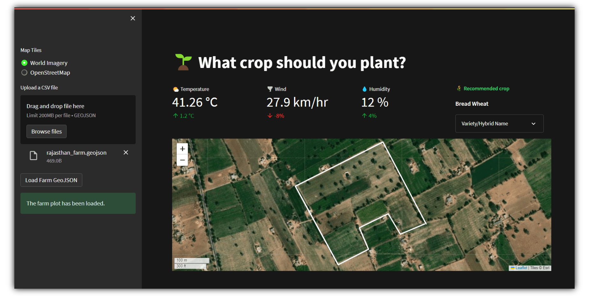

<!-- PROJECT LOGO -->
<br />
<div align="center">

  <h2 align="center">Crop Recommendation System using GIS</h2>

  <p align="center">
    A Streamlit app written in Python using Folium/GeoPandas to help farmers decide what crop to plant based on government recommendations. 
  </p>
    <a href="https://github.com/dnezan/streamlit-geoapp-crop-suggestion">
    
</div>
</br>

<!-- ABOUT THE PROJECT -->
## About The Project

The aim is to create a simple app to suggest a crop for a farmer to grow based on the state they live in, and also display relevant weather information. I have also showcased various GIS techniques using an open source software called QGIS as well as preprocessing and deploying a Streamlit app on the cloud using Python. This app is built using various open source libraries including Pandas/GeoPandas, Folium, shapely, and Streamlit, and sources data from the [Seednet initiative](https://seednet.gov.in/) by the Indian government as well as open weather data using PyOWM to access the [OpenWeatherMap API](https://openweathermap.org/api).

Here's how it works:
* The user uploads a GeoTIFF file containing vector information about their farm plot.
* The app uses latitude and longitude information to check which state the farm plot is located in by referencing a SHP file of Indian states.
* After referring official SeedNet documentation published by the Indian government, the app displays the name of the crop the farmer should plant as well as the type/hybrid name. The app also pulls local weather information via API and displays it to the user.

This app is intended as proof of concept and can thus be easily extended by using various additional metrics such as satellite imagery containing NDVI data, etc.

<!-- GETTING STARTED -->
## Getting Started

Make sure to clone the repo to run the project locally or deploy it on Streamlit Cloud/Heroku.

### Prerequisites

* Using pip
  ```sh
  pip install streamlit folium shapely geopandas pandas pyowm
  ```

### Installation

_Below is an example of how you can instruct your audience on installing and setting up your app. This template doesn't rely on any external dependencies or services._

1. Get a free API Key at [https://example.com](https://example.com)
2. Clone the repo
   ```sh
   git clone https://github.com/your_username_/Project-Name.git
   ```
3. Install NPM packages
   ```sh
   npm install
   ```
4. Enter your API in `config.js`
   ```js
   const API_KEY = 'ENTER YOUR API';
   ```

<!-- USAGE EXAMPLES -->
## Usage

To use this app, you will need vector data of your farm plot. In order to test this app, there are a number of ways to obtain test data. You can either 
* Trace your farm on Google Earth, export to KML, and then convert to GeoJSON using GQIS.
or
* Trace your farm on [GeoJSON.io](https://geojson.io/) and download the .geojson file.

Upload this file using the app. The app will calculate the centroid of the plot, recenter the Folium map view, and display the farm boundary. 


_A plot of farmland in Nagpur, India._


_A plot of farmland in Rajasthan, India._ 

By using latitude and longitude information, the app will check with the OpenWeatherMap API and display local weather conditions. The app will also find what state the plot of land is present in using GeoPandas and a reference state boundaries SHP file, and suggest a crop to grow based on SeedNet's most recent documentation.

<p align="right">(<a href="#readme-top">back to top</a>)</p>

